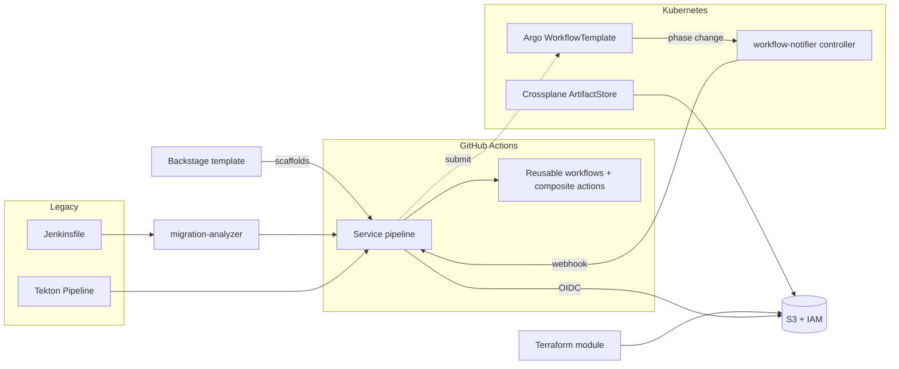

# Jenkins/Tekton → GitHub Actions migration platform

[](https://github.com/henryekeocha/jenkins-to-actions-migration-platform/actions/workflows/ci.yml)

A proof-of-concept platform for moving CI/CD off Jenkins and Tekton onto GitHub Actions, with
the Kubernetes-native delivery tooling a platform team would put around it: Argo Workflows for
in-cluster DAGs, a Go controller that reports workflow completion, Crossplane and Terraform for
the cloud resources pipelines need, and a Backstage template so new services start on the
migrated path.

Everything infrastructure-related is **validate-only**. Nothing in this repo has been applied to
a cloud account or a cluster, and CI never does so. See [docs/ai-workflow.md](docs/ai-workflow.md)
for how it was built and what that means for reading it.

## What is here

| Directory | What | Verified by |
|---|---|---|
| [`legacy/jenkins`](legacy/jenkins) | A realistic declarative Jenkinsfile with a shared library, Docker agent, credentials, parallel stages, an approval gate, locks and Slack/email post actions | |
| [`legacy/tekton`](legacy/tekton) | The same pipeline as a Tekton `Pipeline` with Tasks and a PipelineRun | kubeconform (Tekton v1.15.1 CRDs) |
| [`.github/workflows`](.github/workflows), [`.github/actions`](.github/actions) | The target: reusable `build`, `test`, `image`, `deploy` workflows and `go-build`, `helm-deploy`, `smoke-test`, `notify-slack` composite actions, plus the migrated example pipeline | actionlint, yamllint |
| [`docs/migration-guide.md`](docs/migration-guide.md) | Jenkins / Tekton / Actions concept mapping, a stage-by-stage walkthrough, and the decisions that cannot be automated | |
| [`tools/migration-analyzer`](tools/migration-analyzer) | Python CLI that scans a Jenkinsfile and emits a checklist: every construct classified as manual, review, auto or drop, plus stages, library steps, credential IDs and plugin steps | pytest (20 tests), ruff |
| [`workflows/argo`](workflows/argo) | The same DAG as an Argo `WorkflowTemplate` with a `suspend` approval gate | kubeconform (Argo CRDs) |
| [`controller`](controller) | controller-runtime controller that watches Argo `Workflow`s and POSTs a signed webhook once per terminal phase | go test -race (13 tests), golangci-lint, kubeconform |
| [`infra/crossplane`](infra/crossplane) | Crossplane v2 XRD + function-pipeline Composition: S3 bucket, encryption, versioning, public access block, IAM role and policy | kubeconform against Crossplane, XRD-derived and Upbound provider CRD schemas |
| [`infra/terraform`](infra/terraform) | The same S3 + IAM baseline as a Terraform module with GitHub OIDC trust | terraform fmt, validate |
| [`backstage`](backstage) | Scaffolder template that creates a Go service wired to the reusable workflows, and this repo's catalog entry | upstream JSON schema; rendered skeleton passes actionlint, helm lint, go vet |
| [`docs`](docs) | [architecture](docs/architecture.md), [Terraform vs Crossplane](docs/terraform-vs-crossplane.md), [Backstage](docs/backstage.md), [success metrics](docs/success-metrics.md), [AI workflow](docs/ai-workflow.md) | |
| [`hack`](hack) | The small validators CI uses where no off-the-shelf tool exists | |

## Architecture



[docs/architecture.md](docs/architecture.md) walks the request flow and the boundaries.

## Try the parts that run locally

```
# Migration checklist for the legacy pipeline
pip install -e tools/migration-analyzer
migration-analyzer legacy/jenkins/Jenkinsfile

# Controller tests
cd controller && make test lint

# Terraform
terraform -chdir=infra/terraform init -backend=false && terraform -chdir=infra/terraform validate
```

Everything else is exercised by [CI](.github/workflows/ci.yml): yamllint, actionlint (including
the rendered Backstage skeleton), kubeconform for Tekton, Argo, Crossplane and the controller
manifests, the Backstage schema check, and the analyzer and controller test suites.

## Where the spec's assumptions and current reality differed

Recorded here because checking real APIs was a hard rule:

- **Crossplane v2.4** has no legacy `Resources` composition mode and no claims; XRDs are `v2`
  and namespaced by default. The XRD was written that way. The namespaced Upbound provider CRDs
  also model singleton blocks as objects rather than one-element lists.
- **The Crossplane CLI** (v2.4.0) has no `beta validate`; offline checking is `xrd convert`
  plus schema validation, and `composition render` needs Docker.
- **controller-runtime v0.25.0** requires Go 1.26 and Kubernetes 1.37 client libraries.
- **Argo Workflows v4.1.2** phase constants and `Completed()` semantics match what the
  controller copies; the Workflow CRD has no status subresource.
- **Backstage** templates are still `scaffolder.backstage.io/v1beta3`; nothing deprecated.
- **kubeconform's** schema converter mishandles Tekton's `properties` field, so
  `hack/crd-schemas.py` replaces it.

## License

MIT — see [LICENSE](LICENSE).
