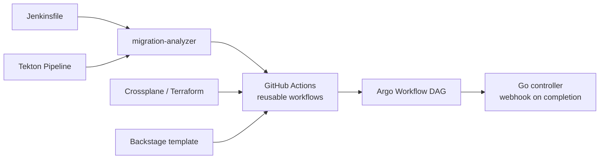

# Jenkins/Tekton → GitHub Actions migration platform

**Status: in progress** — skeleton pushed first so the repo is linkable; each phase lands as its own commit.

A proof-of-concept platform for migrating CI/CD from Jenkins and Tekton to GitHub Actions, with the
Kubernetes-native delivery tooling a platform team would put around it: Argo Workflows for in-cluster
DAGs, a Go controller that watches those workflows and notifies on completion, Crossplane and Terraform
for the cloud resources the pipelines need, and a Backstage template so new services start on the
migrated path by default.

Everything infra-related here is **validate-only**. Nothing in this repo has been applied to a cloud
account or a real cluster, and CI never does so either.

## Planned architecture

- [ ] `legacy/` — the pipelines being migrated: a shared-library-style Jenkinsfile and an equivalent Tekton Pipeline
- [ ] `.github/workflows/` + `.github/actions/` — the migration target: reusable workflows and composite actions for build, test, image build/push, deploy
- [ ] `docs/migration-guide.md` — Jenkins/Tekton → GitHub Actions concept mapping and walkthrough
- [ ] `tools/migration-analyzer/` — Python CLI that scans a Jenkinsfile and produces a migration checklist of constructs needing manual attention
- [ ] `controller/` — Go controller (controller-runtime) that watches Argo `Workflow` resources and fires a webhook on success/failure
- [ ] `workflows/argo/` — the same build-test-deploy DAG as a reusable Argo `WorkflowTemplate`
- [ ] `infra/crossplane/` — Composition provisioning an S3 bucket + IAM role
- [ ] `infra/terraform/` — the same S3 + IAM baseline as a Terraform module (fmt/validate only)
- [ ] `backstage/` — software template that scaffolds a service pre-wired to the GitHub Actions workflows, plus this repo's catalog entry
- [ ] `docs/` — architecture, Terraform-vs-Crossplane point of view, success metrics, and an honest note on how Claude Code was used
- [ ] CI that lints and tests all of the above without touching any cloud or cluster

## Architecture (placeholder — replaced in a later phase)

## License

MIT — see [LICENSE](LICENSE).
