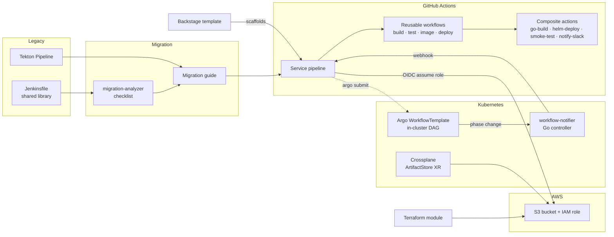

# Architecture

The platform is a set of pieces a team can adopt in any order. The only hard dependency is
that everything downstream of the pipeline assumes GitHub Actions is the front door.

## Request flow for one service

1. A developer runs the Backstage template. It creates a repo with `.github/workflows/ci.yml`
   calling the reusable workflows here, a Helm chart, a Go stub and a catalog entry.
2. On push, `build` compiles and uploads the binary; `test` runs unit tests and lint in
   parallel; `image` builds and pushes to GHCR with the 12-character SHA as the tag.
3. On `main`, `deploy-staging` runs Helm with the `staging` environment's kubeconfig secret
   and smoke-tests the health URL. `deploy-production` is the same workflow gated by the
   `production` environment's required reviewers, triggered from *Run workflow*.
4. If a step is better run in-cluster, the pipeline submits a `Workflow` from the Argo
   `WorkflowTemplate`. The notifier controller sees the phase change and POSTs the outcome to a
   webhook (a `repository_dispatch`, a Slack hook, a status service). The pipeline does not poll.
5. The service's bucket and role exist because an `ArtifactStore` XR was created in its
   namespace (Crossplane) or the Terraform module was applied (platform-owned). The role's
   trust policy allows the repo's GitHub OIDC identity to assume it, so the pipeline needs no
   stored cloud keys.

## Component map

| Directory | Role | Language | Verified by |
|---|---|---|---|
| `legacy/jenkins`, `legacy/tekton` | the source pipelines | Groovy, YAML | kubeconform (Tekton CRDs) |
| `tools/migration-analyzer` | checklist generator | Python | pytest, ruff |
| `.github/workflows`, `.github/actions` | target pipeline building blocks | YAML | actionlint, yamllint |
| `docs/migration-guide.md` | concept mapping and walkthrough | | |
| `workflows/argo` | in-cluster DAG | YAML | kubeconform (Argo CRDs) |
| `controller` | Argo completion webhook | Go | go test -race, golangci-lint, kubeconform |
| `infra/crossplane` | per-team S3 + IAM | YAML | kubeconform (Crossplane and provider CRDs), offline render |
| `infra/terraform` | platform-owned S3 + IAM | HCL | terraform fmt, validate |
| `backstage` | golden path template | YAML | upstream JSON schema, actionlint, helm lint, go vet on the rendered skeleton |

## Boundaries and decisions

- **Nothing is applied.** CI validates schemas, compiles code and runs tests. It never
  authenticates to a cloud or a cluster. That is deliberate for a portfolio repo and is called
  out in each directory's README.
- **GitHub Actions is the orchestrator; Argo is a worker.** The alternative (Argo as
  orchestrator, Actions as a thin trigger) keeps more in-cluster but loses the environment
  protection rules, OIDC and marketplace that make the migration worth doing.
- **The controller does not import Argo.** A partial type for a read-only watch beats a
  dependency on the whole Argo module. The cost, never issuing an Update, is documented in the
  controller README.
- **Crossplane and Terraform both exist on purpose.** `docs/terraform-vs-crossplane.md` says
  which to use for what.
- **Secrets are named, not created.** The analyzer lists credential IDs and suggests secret
  names; the Backstage template tells the user to create environments and secrets. Creating
  them needs cluster access nobody in this repo has.
